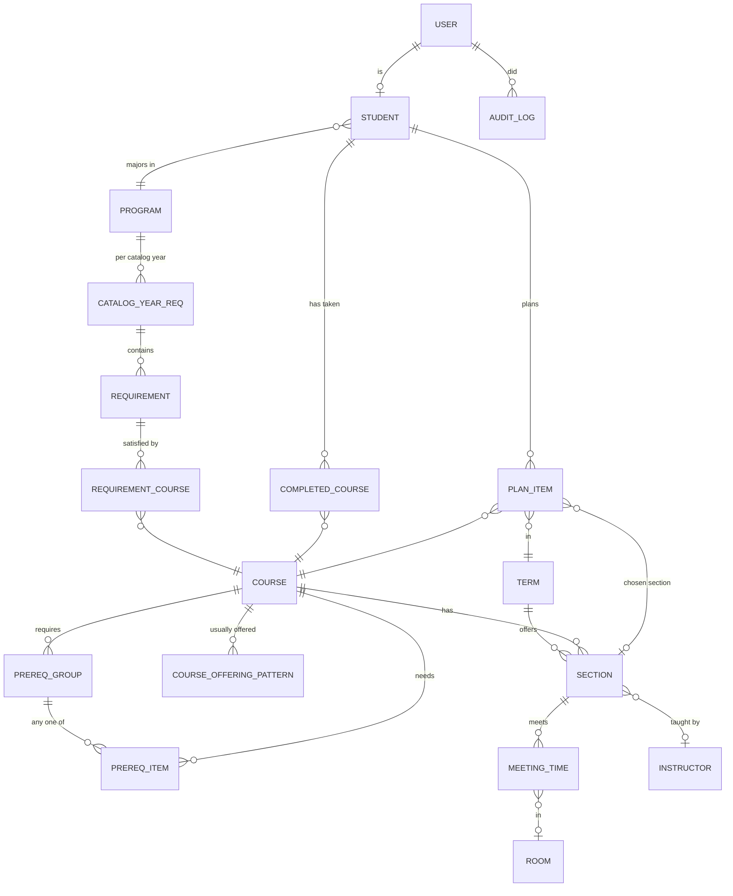

# Visor: Data model (DRAFT v0.1)

Status: **DRAFT**. Needs review from Austin and Gabriel.
Jira: KAN-23
Part of the design spec (02). It will be merged into `02-design.md` once approved.

This model works for either scope direction. It covers the registrar's course timetable (sections, times, rooms, instructors) and student planning (requirements, completed courses, plans). Tables marked *(scope TBD)* can be dropped if the professor narrows v1.

## Diagram

## Tables

### Catalog and schedule

| Table | Key fields | Notes |
|---|---|---|
| **term** | id, code (`2027SP`), name, start_date, end_date, season (FA/SP/SU) | |
| **course** | id, subject (`CS`), number (`3233`), title, credits, active | Unique on (subject, number) |
| **course_offering_pattern** | course_id, season, frequency (`every`, `odd_years`, `even_years`) | Used to plan terms that don't have sections yet |
| **section** | id, course_id, term_id, section_no (`01`), capacity, enrolled_count, instructor_id | Unique on (course_id, term_id, section_no) |
| **meeting_time** | id, section_id, days (bitmask or `MWF`), start_time, end_time, room_id | A section can have more than one (for example lecture plus lab) |
| **room** *(scope TBD)* | id, building, number, capacity | Needed for registrar timetabling |
| **instructor** *(scope TBD)* | id, name, email | Needed so one instructor isn't double-booked |

### Prerequisites

Stored as **AND of OR-groups**. For example, "MATH 1 AND (CS 1 OR CS 2)" becomes two groups:

| Table | Key fields |
|---|---|
| **prereq_group** | id, course_id (the course that has the prerequisite), min_grade (optional), concurrent_ok (bool) |
| **prereq_item** | group_id, required_course_id |

A course's prerequisites are met when **every** group has **at least one** item completed.

### Degree requirements

| Table | Key fields | Notes |
|---|---|---|
| **program** | id, code (`CS-BS`), name | |
| **catalog_year_req** | id, program_id, catalog_year (`2024`) | Students follow the requirements from the year they enrolled |
| **requirement** | id, catalog_year_req_id, name ("Core", "Upper-level electives"), rule (`all` / `choose_n` / `min_credits`), n | |
| **requirement_course** | requirement_id, course_id | |

### Students and plans *(scope TBD)*

| Table | Key fields | Notes |
|---|---|---|
| **student** | id, user_id, student_no, program_id, catalog_year, expected_grad_term_id | |
| **completed_course** | student_id, course_id, term_id, grade, source (`import` / `manual`) | |
| **plan_item** | student_id, course_id, term_id, section_id (nullable), status (`planned` / `approved`) | |

### Users and audit

| Table | Key fields | Notes |
|---|---|---|
| **user** | id, email, name, role (`registrar` / `advisor` / `student`) | Mock login for the demo |
| **advisor_assignment** *(scope TBD)* | advisor_user_id, student_id | Controls which students each advisor can see |
| **audit_log** | id, user_id, action, entity, entity_id, at | Every view or change of a student record (FERPA) |

## How the rules engine uses this

- **Time conflict:** two meeting times conflict when they share at least one day and `a.start < b.end AND b.start < a.end`. Times that only touch (one ends as the other starts) do not conflict.
- **Prerequisite check:** see the AND-of-OR rule above. Completed courses plus courses planned in earlier terms count.
- **Capacity:** a section is full when `enrolled_count >= capacity`.
- **Offered term:** a course is offered in a term if it has a section in that term. If the term has no sections yet, use `course_offering_pattern`.

## Open questions

1. Do we track rooms and instructors in v1? (Depends on the registrar scope.)
2. Do grades matter for prerequisites (for example, a C or better)?
3. Should cross-listed courses (the same class under two course numbers) be supported in v1? Suggested: no.
