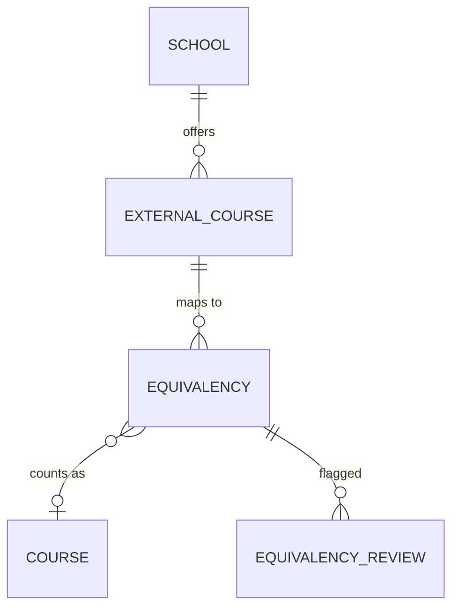

# Visor: Transfer course equivalencies (design, v0.1)

Status: **DRAFT — needs sign-off from Austin, Gabriel, and Firas before Thursday.**
Jira: KAN-37 (epic), KAN-38 (backend), KAN-39 (rules), KAN-40 (UI)
Source: Gabriel's notes from the 10/1 meeting with Ms. Hood (Discord #notes-resources, KAN-35)

## What we're building

A transfer course comes in (school, subject, number, title). Visor answers one of three ways:

| Status | Meaning | What the user sees |
|---|---|---|
| `confirmed` | The registrar has already decided this one | The Lipscomb course it counts as |
| `proposed` | No decision yet, but the rules found a likely match | Ranked candidates with a score; a "flag for review" button |
| `unknown` | Nothing close | "No match" and a "flag for review" button |

"Flag for review" records who should look at it (a professor) so the registrar stops doing that by email. **The app never confirms an equivalency on its own.** Only a person does, and we record who and when.

Out of scope for this slice: pulling catalogs from other schools automatically, transcripts, degree audit. We seed external courses by hand.

## Data model

Adds four tables to `specs/02-design-data-model.md`. `course` is the existing Lipscomb course table.



| Table | Columns | Notes |
|---|---|---|
| **school** | id, name, state (`TN`), kind (`community_college` / `university`), catalog_url, active | Unique on name |
| **external_course** | id, school_id, subject (`COMP`), number (`1010`), title, credits, description (nullable), catalog_year (`2026`), source_url (nullable) | Unique on (school_id, subject, number, catalog_year) |
| **equivalency** | id, external_course_id, course_id (**nullable**), kind (`direct` / `elective` / `none`), status (`confirmed` / `proposed` / `rejected`), source (`sis_import` / `registrar` / `professor` / `rules`), confidence (0–1, nullable), decided_by (text, nullable), decided_at (nullable), notes, updated_at | `course_id` null + kind `elective` = counts as general elective credit; kind `none` = does not transfer. At most one `confirmed` row per external_course |
| **equivalency_review** | id, equivalency_id, requested_by, requested_at, reviewer (name or email), decision (`pending` / `approved` / `rejected`), decided_at (nullable), notes | The "ask a professor" step |

Why `status` lives on the equivalency and not the external course: one external course can have a rejected guess and a later confirmed answer, and we want the history.

`unknown` is not stored. It's what the lookup returns when there is no `confirmed` or `proposed` row and the rules find nothing.

## API contract

All JSON. Errors are `{"error": "message"}` with a 4xx status. The frontend builds against these shapes with mock data first.

### `GET /api/schools`

```json
[{"id": 1, "name": "Nashville State Community College", "state": "TN", "kind": "community_college"}]
```

### `GET /api/schools/<id>/courses?q=comp`

`q` matches subject, number, or title (case-insensitive, optional).

```json
[{"id": 7, "subject": "COMP", "number": "1010", "title": "Intro to Programming", "credits": 3, "catalog_year": "2026"}]
```

### `GET /api/equivalencies?status=proposed`

List equivalencies, optionally filtered by `status` or `school_id`. Returns the same `equivalency` object as below, with `external_course` and `course` embedded.

### `POST /api/equivalencies/lookup`  ← the main one

Request:

```json
{"school_id": 1, "subject": "COMP", "number": "1010", "title": "Intro to Programming"}
```

`school_id` is required. `subject` + `number` are required. `title` is optional but helps the rules.

Response, one of three shapes, always with `status`:

```json
{
  "status": "confirmed",
  "external_course": {"id": 7, "school": "Nashville State Community College", "subject": "COMP", "number": "1010", "title": "Intro to Programming", "credits": 3},
  "equivalency": {"id": 12, "kind": "direct", "course": {"id": 3, "code": "CS 1113", "title": "Programming I", "credits": 3}, "decided_by": "S. Hood", "decided_at": "2026-09-14", "notes": ""},
  "candidates": []
}
```

```json
{
  "status": "proposed",
  "external_course": {...},
  "equivalency": {"id": 15, "kind": "direct", "course": {...}, "confidence": 0.82, "source": "rules"},
  "candidates": [
    {"course": {"id": 3, "code": "CS 1113", "title": "Programming I", "credits": 3}, "score": 0.82, "why": "subject COMP→CS, level 1xxx, title similarity 0.71"},
    {"course": {"id": 4, "code": "CS 1123", "title": "Programming II", "credits": 3}, "score": 0.41, "why": "subject COMP→CS, level 1xxx"}
  ]
}
```

```json
{"status": "unknown", "external_course": {...}, "equivalency": null, "candidates": []}
```

If the external course isn't in the table yet, the backend creates it from the request (so it can be flagged), then runs the rules.

### `POST /api/equivalencies/<id>/flag`

Request: `{"reviewer": "dr.nordstrom@lipscomb.edu", "requested_by": "registrar", "notes": "Looks like CS 1113?"}`
Response: `201` with the `equivalency_review` row. If the lookup returned `unknown`, the frontend first calls `POST /api/equivalencies` to create a `proposed` row with `course_id: null`, then flags it.

### `POST /api/equivalencies` and `PUT /api/equivalencies/<id>`

Registrar creates or confirms an equivalency. Body is the `equivalency` object fields (`external_course_id`, `course_id`, `kind`, `status`, `decided_by`, `notes`). Confirming sets `decided_at`. **Not needed for Thursday** — nice to have.

## Rules (pure Python, `backend/visor/rules/equivalency.py`)

Same contract as the existing `rules/conflicts.py`: dataclasses in, dataclasses out, no Flask or DB imports, so it's testable with no setup.

```python
@dataclass(frozen=True)
class ExternalCourse:
    school: str; subject: str; number: str; title: str; credits: int | None = None

@dataclass(frozen=True)
class LipscombCourse:
    subject: str; number: str; title: str; credits: int

@dataclass(frozen=True)
class TableEntry:          # one equivalency row, already filtered to confirmed/proposed
    external: ExternalCourse; lipscomb: LipscombCourse | None; status: str; kind: str

@dataclass(frozen=True)
class Candidate:
    course: LipscombCourse; score: float; why: str

@dataclass(frozen=True)
class Match:
    status: str                      # confirmed | proposed | unknown
    entry: TableEntry | None         # the table row, if any
    candidates: tuple[Candidate, ...]

def find_equivalency(external, table) -> TableEntry | None: ...
def suggest_candidates(external, lipscomb_courses) -> list[Candidate]: ...
def match(external, table, lipscomb_courses, threshold=0.6) -> Match: ...
```

Scoring for `suggest_candidates` (v0.1, tune later):

- **Subject map** (hand-written dict, e.g. `COMP`/`CISP`/`CSCI` → `CS`, `MATH` → `MA`, `ENGL` → `EN`): match = 0.4, no entry = 0
- **Level**: first digit of the number matches = 0.2
- **Title similarity**: `difflib.SequenceMatcher` ratio × 0.4
- Top candidate ≥ `threshold` → `proposed`; otherwise `unknown`. The score goes in `confidence`.

Rejected table rows are ignored. A confirmed row always wins over candidates.

## Frontend (`frontend/src/`)

- New view `EquivalencyLookup.jsx`: school `<select>` (from `/api/schools`), subject + number inputs, optional title, a Look up button.
- Result card renders by `status` (the three shapes above). Proposed shows candidates as a ranked list with score and `why`.
- "Flag for review" on proposed/unknown: small form (reviewer email, note) → `POST .../flag` → success toast.
- Until the backend lands: `frontend/src/mock/equivalencies.json` holding one response per status, and a `USE_MOCK` flag.
- Keep the existing term/conflicts screen; add a two-link nav at the top.

## Seed data (`data/equivalencies/`)

Fake but realistic, clearly labeled as sample data. Three CSVs the seed command loads after the existing ones:

- `schools.csv` — 3 Tennessee schools (community colleges Lipscomb actually gets transfers from are a good pick; names only, no scraped data)
- `external_courses.csv` — ~20 courses across them, mostly 1000/2000-level CS, math, English
- `equivalencies.csv` — ~15 rows: a mix of `confirmed` direct matches, a couple of `elective`, one `none`, two `proposed`, one `rejected`. Leave a few external courses with no row so `unknown` has something to hit.

Real data replaces this once Ms. Hood sends the SIS export (KAN-36).

## Who does what for Thursday

| Branch | Owner | Jira | Presents |
|---|---|---|---|
| `KAN-38-equivalency-backend` | Austin | KAN-38 | Models, seed, API — live calls |
| `KAN-39-equivalency-rules` | Gabriel | KAN-39 | Matching rules — 3 worked examples, tests |
| `KAN-40-equivalency-ui` | Firas | KAN-40 | Lookup page — click through all three states |

Each branch gets its own Vercel preview URL on push. Merge order after Thursday: rules → backend → UI.

## Open questions

1. What subject prefixes do the top transfer schools use? (Need the school list from Ms. Hood — until then the subject map is a guess.)
2. Does one external course ever map to *two* Lipscomb courses (or two external → one)? v0.1 says no; revisit when we see the SIS export.
3. Who is allowed to confirm — registrar only, or professors too? Affects roles (KAN-29).
